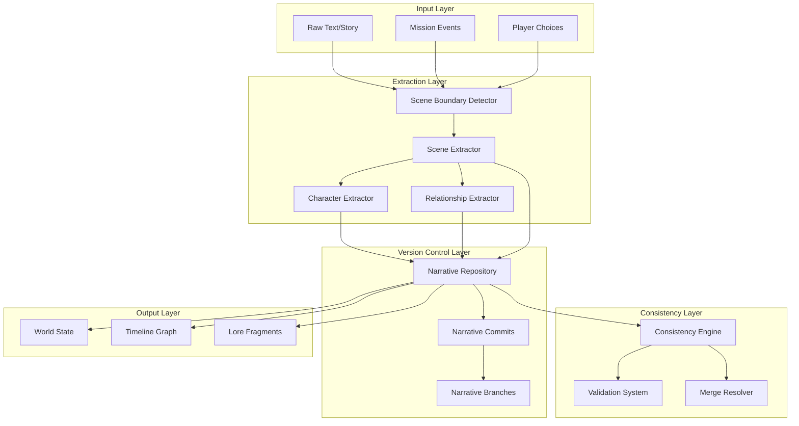
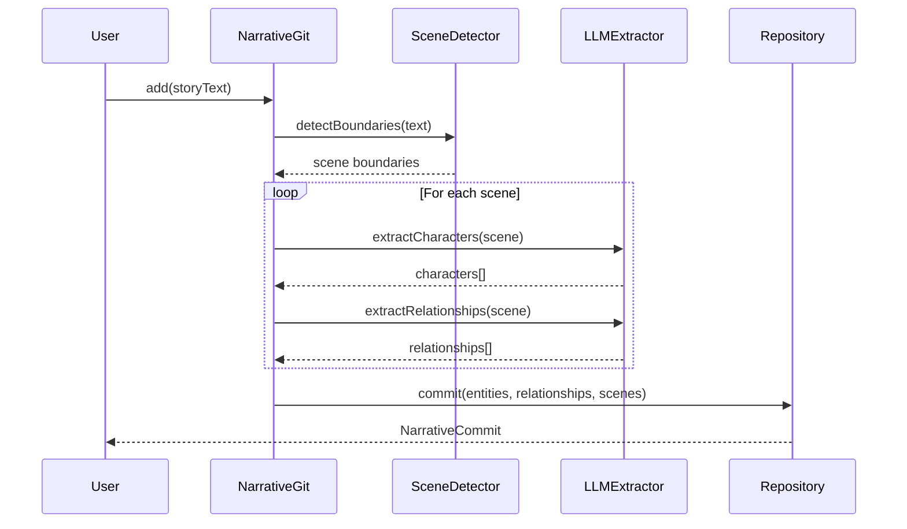
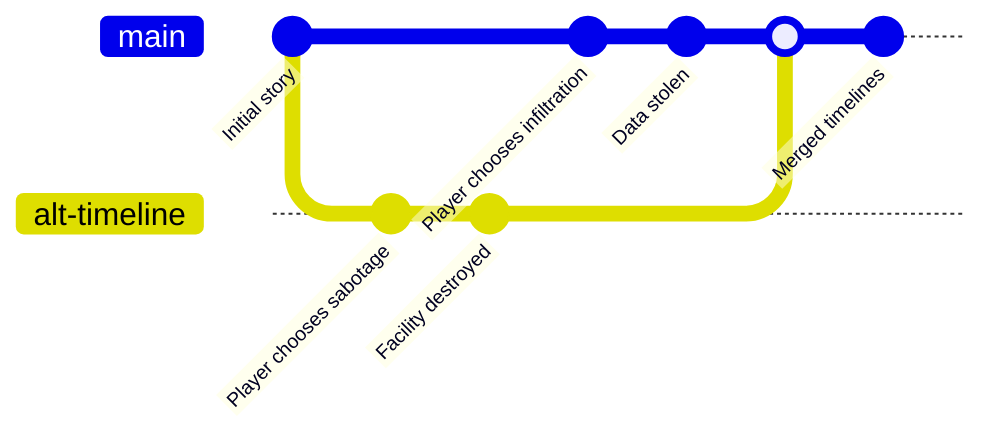
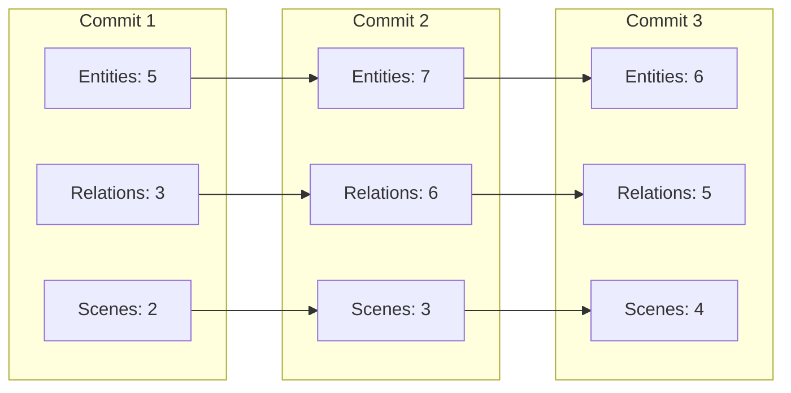
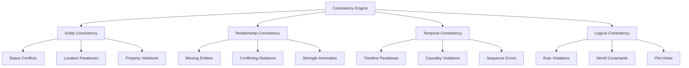

> ⚠️ **SUPERSEDED RELIC** — this doc predates the Narrative Studio and describes an earlier system. Do NOT use it for orientation; start at [`AGENTS.md`](./AGENTS.md) (adjust path from docs/: `../AGENTS.md`).

# 🎭 Narrative Git: Complete System Guide

## Table of Contents
1. [Overview](#overview)
2. [Core Architecture](#core-architecture)
3. [How It Works](#how-it-works)
4. [Data Structures](#data-structures)
5. [Key Operations](#key-operations)
6. [Consistency Engine](#consistency-engine)
7. [Practical Examples](#practical-examples)
8. [Game Integration Guide](#game-integration-guide)
9. [API Reference](#api-reference)

## Overview

Narrative Git is a version control system for stories, designed to track narrative evolution, maintain consistency, and enable collaborative storytelling. Think of it as "Git for stories" - it tracks changes, manages branches, detects conflicts, and ensures narrative coherence.

### Key Features
- 📚 **Version Control**: Track every change to your narrative universe
- 🌳 **Branching**: Explore alternative storylines and timelines
- 🔀 **Merging**: Combine different narrative paths intelligently
- 🔍 **Consistency Checking**: Automatically detect plot holes and contradictions
- 🤖 **AI-Powered Extraction**: Convert raw text into structured narrative data
- 🎮 **Game-Ready**: Perfect for managing player-generated content

## Core Architecture



## How It Works

### 1. Text Input → Structured Data

When you feed text into the system, it goes through several extraction phases:



### 2. Version Control System

Every change creates a commit with a unique hash:



### 3. World State Tracking

The system maintains a complete world state at every point:



## Data Structures

### NarrativeCommit
```typescript
{
  id: string;                      // Unique identifier
  hash: string;                    // SHA-256 hash for integrity
  parentCommits: string[];         // Parent commit(s) for branching
  timestamp: Date;                 // When this happened
  author: string;                  // Who made this change
  message: string;                 // Commit message
  
  // What changed
  entities: EntityChange[];        // Character/location/object changes
  relationships: RelationshipChange[]; // How entities relate
  scenes: SceneChange[];           // Story progression
  
  // Current state
  worldState: WorldStateSnapshot;  // Complete world at this moment
  
  // Metadata
  branch: string;                  // Which timeline
  significance: number;            // How important (0-1)
  conflictResolutions: Resolution[]; // How conflicts were resolved
}
```

### Entity Tracking
```typescript
{
  id: "char_alexandra",
  name: "Alexandra Morozova",
  type: "character",
  status: "active",
  properties: {
    role: "resistance_leader",
    location: "neo_tokyo",
    allegiance: "green_loom",
    abilities: ["hacking", "combat", "leadership"]
  },
  relationships: ["rel_001", "rel_002"],
  lastModified: "commit_abc123",
  significance: 0.95
}
```

### Relationship Network
```typescript
{
  id: "rel_001",
  source: "char_alexandra",
  target: "org_oneirocom",
  type: "enemy",
  strength: 0.9,
  evidence: ["Sabotaged facility in 2027", "Leaked classified data"],
  temporal: "permanent",
  lastModified: "commit_def456"
}
```

## Key Operations

### 1. Adding Narrative Content

```typescript
// Add initial story
const commit1 = await narrativeGit.add(
  storyText, 
  "Initial story setup",
  "Chapter 1: The Beginning"
);

// Continue the story
const commit2 = await narrativeGit.append(
  continuationText,
  "Alexandra discovers the truth"
);
```

### 2. Branching Timelines

```typescript
// Create alternate timeline
narrativeGit.branch("dark-timeline", "Oneirocom wins");
narrativeGit.checkout("dark-timeline");

// Add events to this timeline
await narrativeGit.add(darkOutcome, "The resistance falls");

// Return to main timeline
narrativeGit.checkout("main");
```

### 3. Querying the Narrative

```typescript
// Find all mentions of a character
const alexandra = narrativeGit.find("Alexandra");

// Get relationship network
const relationships = narrativeGit.relationships();

// Check current world state
const world = narrativeGit.world();
console.log(`Active entities: ${world.entities.size}`);
console.log(`Active relationships: ${world.relationships.size}`);
```

## Consistency Engine

The consistency engine automatically detects and reports narrative issues:

### Types of Consistency Checks



### Example Consistency Checks

1. **Entity Death Paradox**
```typescript
// DETECTED: Character appears after death
{
  type: 'entity_conflict',
  severity: 'critical',
  description: 'Alexandra appears in scene 5 but died in scene 3',
  suggestedResolution: 'Create alternate timeline or resurrection event'
}
```

2. **Relationship Conflict**
```typescript
// DETECTED: Contradictory relationships
{
  type: 'relationship_conflict',
  severity: 'major',
  description: 'Alexandra is both ally and enemy of Marcus',
  suggestedResolution: 'Clarify relationship evolution or betrayal'
}
```

3. **Location Impossibility**
```typescript
// DETECTED: Character in two places
{
  type: 'temporal_paradox',
  severity: 'major',
  description: 'Proxim8_001 on mission in Tokyo and London simultaneously',
  suggestedResolution: 'Adjust mission timing or add travel scene'
}
```

## Practical Examples

### Example 1: Mission Report Processing

```typescript
// Player completes a mission
const missionReport = `
Agent X7-391 infiltrated Oneirocom's Tokyo facility.
Discovered Project Prometheus documents revealing consciousness transfer experiments.
Planted virus in mainframe. Narrowly escaped when Dr. Chen triggered alarm.
Established contact with insider: Yuki Tanaka, sympathetic researcher.
`;

// Add to narrative
const commit = await narrativeGit.add(
  missionReport,
  `Mission ${missionId}: Tokyo infiltration by ${playerId}`
);

// Check consistency
const issues = await narrativeGit.check();
if (issues.length === 0) {
  // Mission canonically accepted
  console.log('Mission report added to canon timeline');
} else {
  // Handle inconsistencies
  console.log('Timeline conflicts detected:', issues);
}

// Extract discovered entities
const entities = narrativeGit.find("Yuki Tanaka");
// Returns: New character with 'potential_ally' status

// Update relationships
const relationships = narrativeGit.relationships();
// Now includes: Yuki Tanaka --[sympathetic_to]--> Resistance
```

### Example 2: Timeline Branching from Player Choice

```typescript
// Critical mission moment
const choice1 = "Destroy the facility";
const choice2 = "Steal the data";

// Create branches for each choice
narrativeGit.branch("timeline-destroy", "Aggressive approach");
narrativeGit.branch("timeline-steal", "Stealthy approach");

// Process choice 1
narrativeGit.checkout("timeline-destroy");
await narrativeGit.add(
  "The facility explodes. Oneirocom's research is set back years.",
  "Facility destroyed"
);

// Process choice 2
narrativeGit.checkout("timeline-steal");
await narrativeGit.add(
  "Data successfully extracted. Oneirocom remains unaware.",
  "Data theft successful"
);

// Check which timeline is more coherent
const destroyScore = (await narrativeGit.status()).worldState.consistencyScore;
narrativeGit.checkout("timeline-steal");
const stealScore = (await narrativeGit.status()).worldState.consistencyScore;

// Merge the more consistent timeline
if (stealScore > destroyScore) {
  narrativeGit.checkout("main");
  await narrativeGit.executeMerge(
    await narrativeGit.merge("timeline-steal", "main")
  );
}
```

### Example 3: Lore Fragment Generation

```typescript
// After multiple missions in Neo-Tokyo
const tokyoEvents = await narrativeGit.world()
  .sceneTimeline
  .filter(scene => scene.location === "neo_tokyo");

// Generate lore fragment
const loreSummary = {
  title: "Neo-Tokyo Resistance Network",
  content: generateLoreFromEvents(tokyoEvents),
  entities: narrativeGit.find("location:neo_tokyo"),
  significance: calculateSignificance(tokyoEvents),
  canonStatus: "verified"
};

// Add to permanent lore
await narrativeGit.add(
  loreSummary.content,
  "Lore Fragment: Neo-Tokyo Network established"
);
```

## Game Integration Guide

### 1. Mission Generation

Use world state to create contextual missions:

```typescript
async function generateMission(date: string, location: string) {
  const world = narrativeGit.world();
  
  // Find relevant entities at location
  const localEntities = Array.from(world.entityStates.values())
    .filter(e => e.properties.location === location);
  
  // Check recent events
  const recentScenes = world.sceneTimeline
    .filter(s => s.location === location)
    .slice(-5);
  
  // Generate mission based on context
  return {
    briefing: createBriefing(localEntities, recentScenes),
    objectives: determineObjectives(world, location),
    risks: assessRisks(localEntities),
    rewards: calculateRewards(world.metrics.narrativeComplexity)
  };
}
```

### 2. Mission Validation

Ensure player actions maintain consistency:

```typescript
async function validateMissionReport(report: string, missionId: string) {
  // Create temporary branch
  narrativeGit.branch(`mission-${missionId}`, "Testing mission outcome");
  narrativeGit.checkout(`mission-${missionId}`);
  
  // Add report
  await narrativeGit.add(report, `Mission ${missionId} report`);
  
  // Check consistency
  const issues = await narrativeGit.check();
  const score = (await narrativeGit.status()).worldState.consistencyScore;
  
  // Cleanup
  narrativeGit.checkout("main");
  
  return {
    valid: issues.length === 0,
    score,
    issues,
    canMerge: score > 0.8
  };
}
```

### 3. Timeline Visualization

Generate data for timeline UI:

```typescript
function getTimelineData() {
  const history = narrativeGit.log();
  const world = narrativeGit.world();
  
  return {
    nodes: history.map(commit => ({
      id: commit.hash,
      date: commit.timestamp,
      author: commit.author,
      greenLoomInfluence: calculateGreenInfluence(commit),
      greyLoomInfluence: calculateGreyInfluence(commit),
      significance: commit.significance
    })),
    
    branches: narrativeGit.branches().map(branch => ({
      name: branch.name,
      divergencePoint: branch.createdFrom,
      commits: branch.commits.length,
      status: branch.status
    })),
    
    currentState: {
      entities: world.entityStates.size,
      relationships: world.activeRelationships.size,
      consistencyScore: world.consistencyScore
    }
  };
}
```

### 4. Reward Calculation

Base rewards on narrative impact:

```typescript
function calculateMissionRewards(missionReport: string) {
  const commit = await narrativeGit.add(missionReport, "temp");
  
  const rewards = {
    timelinePoints: 100 * commit.significance,
    
    loreFragments: commit.entities
      .filter(e => e.changeType === 'create')
      .map(e => ({
        id: e.entityId,
        rarity: e.entity.significance > 0.8 ? 'legendary' : 'common'
      })),
    
    influencePoints: {
      greenLoom: commit.worldState.metrics.plotCohesion * 100,
      greyLoom: (1 - commit.worldState.metrics.worldConsistency) * 100
    },
    
    bonusMultiplier: commit.worldState.consistencyScore
  };
  
  return rewards;
}
```

## API Reference

### Core Methods

```typescript
class NarrativeGit {
  // Adding content
  async add(text: string, message?: string, title?: string): Promise<NarrativeCommit>
  async append(text: string, message?: string): Promise<NarrativeCommit>
  
  // Branching
  branch(name: string, description?: string): NarrativeBranch
  checkout(branchName: string): boolean
  
  // Merging
  async merge(source: string, target?: string): Promise<MergeRequest>
  async executeMerge(request: MergeRequest): Promise<NarrativeCommit>
  
  // Querying
  find(query: string): NarrativeEntity[]
  relationships(): Map<string, NarrativeRelationship[]>
  world(): WorldStateSnapshot
  log(branch?: string): NarrativeCommit[]
  
  // Consistency
  async check(): Promise<Inconsistency[]>
  async status(): Promise<NarrativeStatus>
}
```

### Event Handlers

```typescript
// On mission completion
narrativeGit.on('commit', (commit) => {
  updateTimeline(commit);
  generateLoreFragments(commit);
  checkAchievements(commit);
});

// On inconsistency detected
narrativeGit.on('inconsistency', (issue) => {
  if (issue.severity === 'critical') {
    alertGameMasters(issue);
  }
});

// On merge conflict
narrativeGit.on('merge-conflict', (conflict) => {
  createCommunityVote(conflict);
});
```

## Advanced Features

### 1. Predictive Timeline

```typescript
// Predict future state based on current trajectory
const prediction = narrativeGit.predictFuture(10); // 10 commits ahead
console.log('Predicted green loom probability:', prediction.greenLoomProbability);
```

### 2. Narrative Patterns

```typescript
// Detect recurring patterns
const patterns = narrativeGit.analyzePatterns();
patterns.forEach(pattern => {
  console.log(`Pattern: ${pattern.name}`);
  console.log(`Frequency: ${pattern.occurrences}`);
  console.log(`Next likely: ${pattern.prediction}`);
});
```

### 3. Community Canon

```typescript
// Vote on canonical timeline
const canonVote = await narrativeGit.proposeCanon('main');
canonVote.on('complete', (result) => {
  if (result.approved) {
    narrativeGit.setCanonical(result.branch);
  }
});
```

## Best Practices

1. **Atomic Commits**: Each mission report should be one commit
2. **Meaningful Messages**: Use descriptive commit messages
3. **Regular Consistency Checks**: Run checks before major events
4. **Branch for Experiments**: Test outcomes in branches first
5. **Merge Carefully**: Review impacts before merging timelines

## Troubleshooting

### Common Issues

1. **High Inconsistency Count**
   - Review recent commits with `git.log()`
   - Identify conflicting entities
   - Create branch to test fixes

2. **Merge Conflicts**
   - Use `merge.conflicts` to see issues
   - Manually resolve or use AI arbitration
   - Test in branch before merging

3. **Performance Issues**
   - Limit history depth with `log(branch, limit)`
   - Archive old branches
   - Use snapshots for read-only operations

## Conclusion

The Narrative Git system provides a robust foundation for managing complex, branching narratives in games. By treating story elements as versionable data, it enables unprecedented control over collaborative storytelling while maintaining consistency and coherence.

For your Temporal Missions game, this means:
- Every player action is tracked and validated
- The timeline evolves coherently based on collective choices
- Contradictions are caught and resolved automatically
- Rich lore emerges from player interactions
- The world feels alive and responsive

The system scales from simple mission reports to complex, multi-timeline narratives spanning decades of in-game history. It's the perfect tool for building a living, breathing game world shaped by your community.