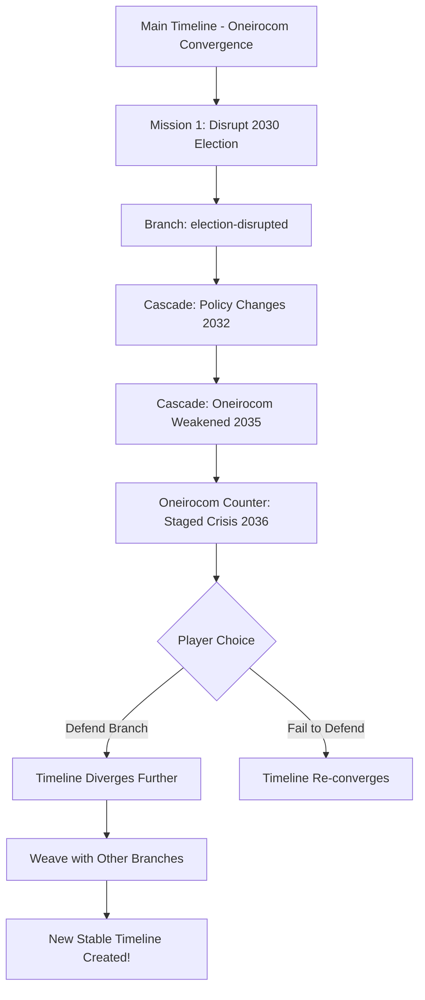

# Timeline Warfare: Narrative Git Game Design

## Core Concept: All Roads Lead to Rome

Oneirocom has engineered all timelines to converge on a single outcome - their total control in 2089. The resistance deploys Proxim8s to create divergence, while Oneirocom deploys counter-narratives to re-converge the timelines.

## Narrative Git Implementation

### 1. The Convergent Baseline

```javascript
// Initialize with Oneirocom's "perfect" timeline
const timelineWar = new NarrativeGit({
  projectName: 'timeline-warfare',
  llmConfig: { provider: 'gemini' }
});

await timelineWar.init();
await timelineWar.add('The Convergent Timeline - all paths lead to Oneirocom dominance');

// This is the "main" branch - Oneirocom's desired outcome
```

### 2. Mission Success = New Branch

Each successful Proxim8 mission creates a timeline branch:

```javascript
// Player completes "Hack the 2030 Election" mission
await timelineWar.branch('timeline-2030-election-disrupted');
await timelineWar.checkout('timeline-2030-election-disrupted');

await timelineWar.addAtTime(
  'The 2030 election results were mysteriously altered. Green Party candidate wins.',
  new Date('2030-11-15'),
  'Proxim8 Mission Success: Election Disruption'
);
```

### 3. Cascade Effects System

Key innovation: Changes propagate forward in time:

```javascript
class CascadeEngine {
  async calculateCascade(change, worldState) {
    // Determine how this change affects future events
    const cascadeEffects = [];
    
    if (change.type === 'political' && change.magnitude > 0.7) {
      // Major political change cascades to:
      cascadeEffects.push({
        date: addYears(change.date, 2),
        description: 'Policy shifts enable renewable energy boom',
        magnitude: 0.6
      });
      
      cascadeEffects.push({
        date: addYears(change.date, 5),
        description: 'Oneirocom loses government contracts',
        magnitude: 0.8
      });
    }
    
    return cascadeEffects;
  }
}
```

### 4. Oneirocom's Counter-Narratives

When timeline divergence is detected, Oneirocom deploys counter-missions:

```javascript
class OneirocomResponse {
  async deployCounterNarrative(divergence) {
    // Analyze the divergence
    const threat = this.assessThreatLevel(divergence);
    
    if (threat > 0.5) {
      // Generate counter-mission
      return {
        type: 'counter-narrative',
        target: divergence.branchPoint,
        narrative: this.generateConvergenceNarrative(divergence),
        deadline: addDays(new Date(), 7) // Players have 7 days to defend
      };
    }
  }
  
  generateConvergenceNarrative(divergence) {
    // Create a narrative that pulls timeline back to convergence
    return `Oneirocom deploys Project ${generateCodename()} to ensure 
            the ${divergence.event} leads back to the intended outcome...`;
  }
}
```

### 5. Timeline Weaving Mechanics

Players must weave divergent threads into coherent alternate timelines:

```javascript
class TimelineWeaver {
  async weaveTimelines(branches) {
    // Check if branches can form coherent alternate timeline
    const coherenceScore = this.calculateCoherence(branches);
    
    if (coherenceScore > 0.8) {
      // Success! Create new stable timeline
      const newTimeline = await this.mergeIntoAlternateTimeline(branches);
      return {
        success: true,
        timeline: newTimeline,
        stability: coherenceScore
      };
    }
    
    // Not enough coherence - Oneirocom can still converge
    return {
      success: false,
      message: 'Timeline threads lack coherence. Oneirocom convergence imminent.'
    };
  }
}
```

## Game Flow Example



## Implementation Strategy

### Phase 1: Branch Creation
```javascript
// Each mission success creates a branch
async function onMissionSuccess(mission) {
  const branchName = `timeline-${mission.date}-${mission.codename}`;
  await timelineWar.branch(branchName);
  await timelineWar.checkout(branchName);
  
  // Add the changed event
  await timelineWar.addAtTime(
    mission.successNarrative,
    mission.targetDate,
    `Proxim8 Success: ${mission.name}`
  );
  
  // Calculate cascades
  const cascades = await cascadeEngine.calculateCascade(mission);
  for (const cascade of cascades) {
    await timelineWar.addAtTime(
      cascade.description,
      cascade.date,
      'Cascade Effect'
    );
  }
}
```

### Phase 2: Convergence Pressure
```javascript
// Oneirocom tries to collapse branches
async function oneirocomResponse(activeBranches) {
  for (const branch of activeBranches) {
    const divergence = await calculateDivergence(branch, 'main');
    
    if (divergence > THREAT_THRESHOLD) {
      const counter = await oneirocom.deployCounterNarrative(branch);
      
      // Create counter-mission for players
      await missionSystem.createDefenseMission({
        type: 'defend-timeline',
        branch: branch,
        threat: counter,
        reward: divergence * 1000 // Higher divergence = better reward
      });
    }
  }
}
```

### Phase 3: Timeline Weaving
```javascript
// Players attempt to weave stable alternate timeline
async function attemptTimelineWeaving(selectedBranches) {
  // Check narrative coherence
  const analysis = await timelineWeaver.analyzeCoherence(selectedBranches);
  
  if (analysis.conflicts.length > 0) {
    return {
      success: false,
      feedback: 'Timeline conflicts detected:',
      conflicts: analysis.conflicts,
      suggestion: 'Complete missions to resolve conflicts'
    };
  }
  
  // Attempt the weave
  const result = await timelineWeaver.weaveTimelines(selectedBranches);
  
  if (result.success) {
    // New stable timeline achieved!
    await unlockNewContent(result.timeline);
    await rewardPlayers(result.participants);
  }
  
  return result;
}
```

## Narrative Consistency Rules

1. **Cascade Propagation**: Changes must ripple forward
   ```javascript
   // A 2030 change affects 2035, 2040, etc.
   cascadeMultiplier = 1.0 - (yearsSinceChange * 0.1);
   ```

2. **Convergence Resistance**: More branches = harder to converge
   ```javascript
   convergenceDifficulty = activeBranches.length ** 2;
   ```

3. **Coherence Requirements**: Branches must tell consistent story
   ```javascript
   coherenceScore = (sharedEntities + alignedThemes) / totalComplexity;
   ```

## Player Experience

1. **See Timeline Divergence**: Visual representation of how far they've pushed the timeline
2. **Defend Critical Moments**: When Oneirocom counters, players must respond
3. **Coordinate Weaving**: Multiple players contribute branches to create new timelines
4. **Cascade Discovery**: Unlock how early changes affect later events

## Technical Integration

```javascript
// In your game server
class TimelineWarfareGame {
  constructor() {
    this.narrativeGit = new NarrativeGit(config);
    this.cascadeEngine = new CascadeEngine();
    this.oneirocom = new OneirocomResponse();
    this.weaver = new TimelineWeaver();
  }
  
  async processGameTick() {
    // Check all active branches
    const branches = await this.narrativeGit.branches();
    
    // Calculate divergence
    for (const branch of branches) {
      const divergence = await this.calculateDivergence(branch);
      
      // Trigger Oneirocom response if needed
      if (divergence > THRESHOLD) {
        await this.oneirocom.deployCounterNarrative(branch);
      }
    }
    
    // Check for weaving opportunities
    const weaveable = await this.weaver.findWeaveableThreads(branches);
    if (weaveable.length >= 3) {
      await this.notifyPlayers('Timeline weaving opportunity detected!');
    }
  }
}
```

## This Design Enables:

1. **Dynamic Narrative**: Story evolves based on player actions
2. **Meaningful Choices**: Each mission genuinely affects the timeline
3. **Collaborative Storytelling**: Players work together to weave new realities
4. **Narrative Tension**: Constant push-pull with Oneirocom
5. **Emergent Complexity**: Cascade effects create unexpected storylines

The beauty is that your narrative git system can track all of this - every branch, every merge attempt, every cascade effect. Players are literally rewriting history, and Oneirocom is trying to edit it back!