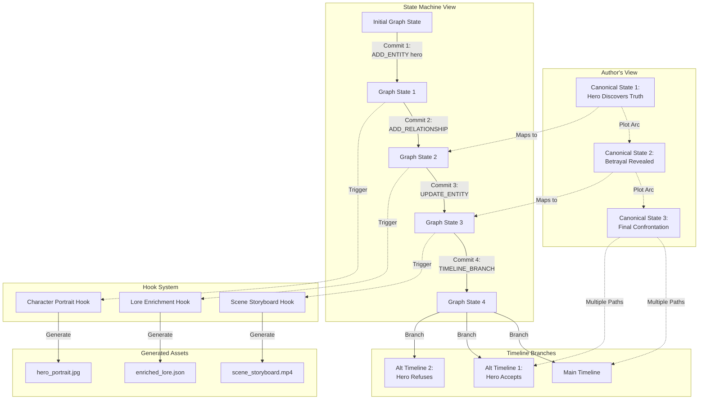

# Narrative State Machine Architecture Diagram



## Flow Explanation

### 1. Author Defines Canonical States
Authors think in terms of major plot points that must be reached. These are the "canonical states" - critical moments in the narrative.

### 2. State Machine Tracks Graph Evolution
The narrative progresses through commits that modify the graph:
- **ADD_ENTITY**: Introduce characters, locations, objects
- **UPDATE_ENTITY**: Change properties, status, relationships
- **ADD_RELATIONSHIP**: Form connections between entities
- **TIMELINE_BRANCH**: Create alternate possibilities

### 3. Hooks Generate Assets
When certain conditions are met, hooks automatically trigger:
- New character → Generate portrait
- Scene complete → Create storyboard
- Entity added → Enrich backstory

### 4. Timeline Branching
At key decision points, the narrative can branch into multiple timelines, each with different probabilities of becoming "canon."

## Example Commit Structure

```typescript
// A single narrative commit
{
  id: "commit_001",
  operations: [
    {
      type: "ADD_ENTITY",
      payload: {
        id: "kira_001",
        type: "character",
        name: "Kira",
        properties: {
          location: "Neo-Tokyo",
          status: "investigating"
        }
      }
    },
    {
      type: "ADD_RELATIONSHIP",
      payload: {
        type: "discovered",
        source: "kira_001",
        target: "glitch_sector7"
      }
    }
  ],
  canonicalEvent: {
    name: "The Discovery",
    significance: "critical"
  }
}
```

## Living Lore Bible Structure

```
LoreBible/
├── Timelines/
│   ├── main/
│   │   ├── commits/
│   │   ├── current-state.json
│   │   └── canonical-states.json
│   └── branches/
│       ├── alt-timeline-1/
│       └── alt-timeline-2/
├── Assets/
│   ├── characters/
│   │   └── kira/
│   │       ├── portrait.jpg
│   │       ├── backstory.md
│   │       └── timeline.json
│   ├── locations/
│   └── scenes/
└── Hooks/
    ├── registered/
    └── execution-log/
```

This architecture transforms narrative from linear text into a living, branching, asset-generating consciousness technology!